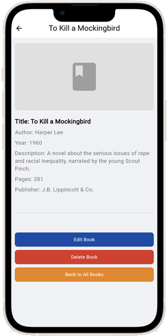
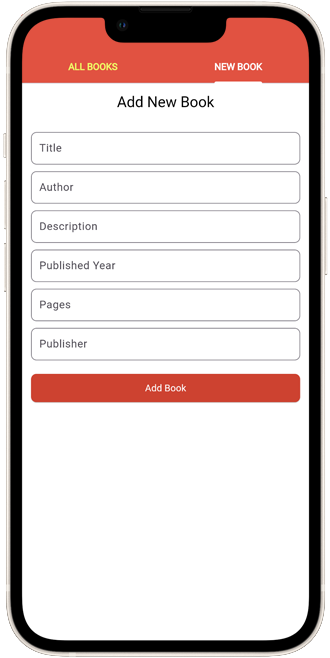
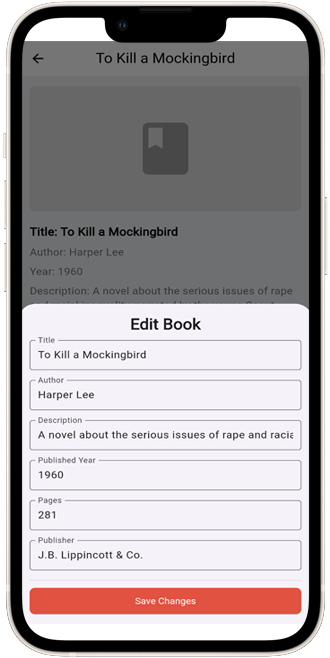
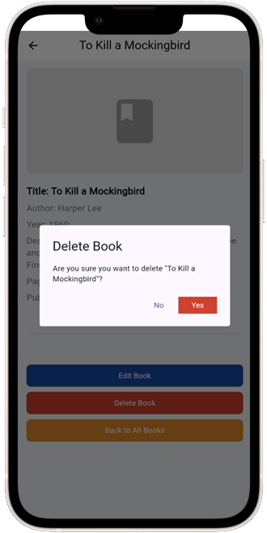

# Library-system Frontend (Flutter)

## Getting Started

### Description

This is a library system frontend built with flutter. This project is a part of my final project in my interview process to build a library system. This project is built with flutter and the backend is built with nodejs with pure typescript.

you can check the backend project [here](https://github.com/ivandj0h/library-system-backend-service.git) and you have to clone the backend project to run this project.

### Usage

to run this project, there are several steps that you have to do :

- Clone this project :

```bash
git clone https://github.com/ivandj0h/library-system-frontend-flutter.git
```

- Install the dependencies :

```bash
flutter pub get
```

- Run the project :

```bash

flutter run
```

- if you're using android studio, you can run the project by clicking the run button on the top right corner of the android studio.
- if you're using vscode, you can run the project by pressing `F5` on your keyboard.
- if you're using terminal, you can run the project by typing `flutter run` on your terminal.
- if you're using intellij, you can run the project by clicking the run button on the top right corner of the intellij.
- if you're using macos, windows or linux, you can run the project by typing `flutter run` on your terminal.
- if you're using web, you can run the project by typing `flutter run -d chrome` on your terminal.

it's very helpful to run the project on web because you can see the project on your browser.

### Features

- [x] Get all books
- [x] Get individual book / get book by id
- [x] Add book
- [x] Update book
- [x] Delete book

### Dependencies

- [http](https://pub.dev/packages/http)
- [fluttertoast](https://pub.dev/packages/fluttertoast)

### Built Production

- [x] Android

to build the project for android, you can run this command :

```bash
flutter build apk
```

- [x] IOS

to build the project for ios, you can run this command :

```bash
flutter build ios
```

- [x] Web

to build the project for web, you can run this command :

```bash
flutter build web
```

### ScreenShoot

- Home Page (Get all books)


- Get Book by ID



- Add or Create Book



- Update Book



- Delete Book



## Credits

Linkedin : [ivandjoh](https://linkedin.com/in/ivandjoh)

Github : [ivandjoh](https://github.com/ivandj0h)
